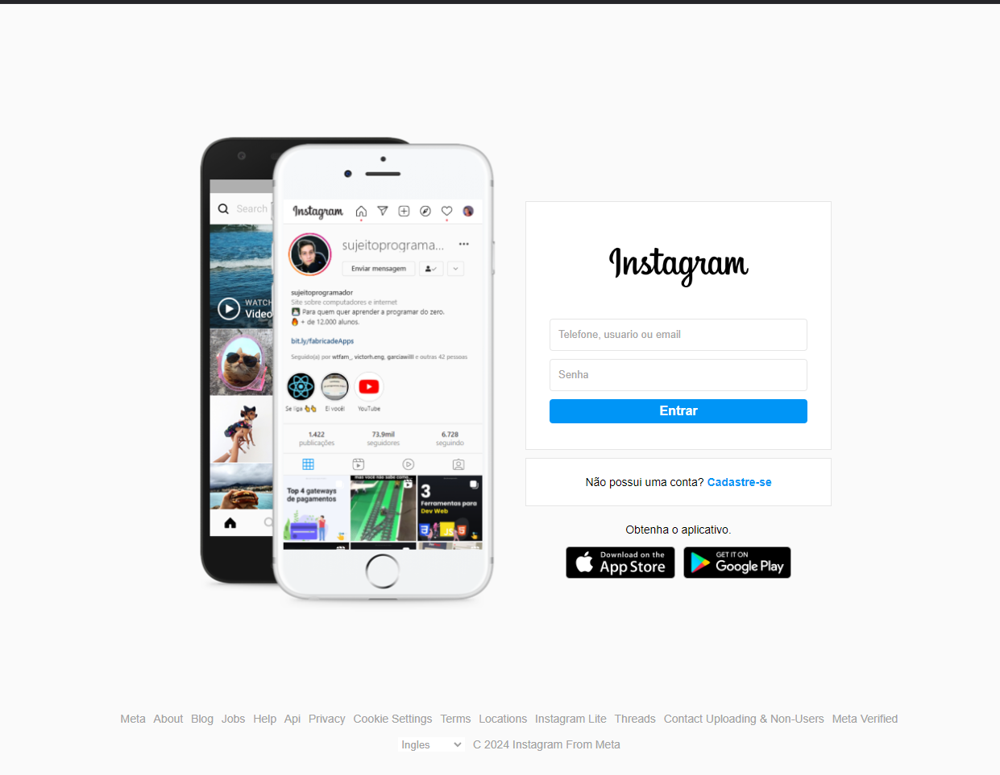

# Instagram Clone

Este é um clone da página inicial do Instagram, desenvolvido utilizando apenas HTML e CSS. O projeto foi criado como parte de um estudo de front-end, visando praticar habilidades de layout, responsividade e design visual.

## Demonstração



## Sobre o Projeto

Este projeto é uma recriação da página inicial do Instagram utilizando apenas HTML e CSS. O foco está no design responsivo e na estrutura semântica do código. Não há funcionalidades de JavaScript, apenas a estrutura estática.

## Tecnologias Utilizadas

- **HTML5**: para a marcação da estrutura da página.
- **CSS3**: para a estilização e design responsivo.

## Funcionalidades

- Layout responsivo adaptado para diferentes tamanhos de tela (desktop, tablet e mobile).
- Estilo visual próximo ao da página original do Instagram.
- Estrutura semântica de HTML para facilitar a acessibilidade.

## Como Executar

1. Clone o repositório:
   ```bash
   git clone https://github.com/henriquedevop/Henrigram-project.git

2. Navegue até a pasta do projeto::
   ```bash
   cd src

3. Abra o arquivo index.html no seu navegador.
